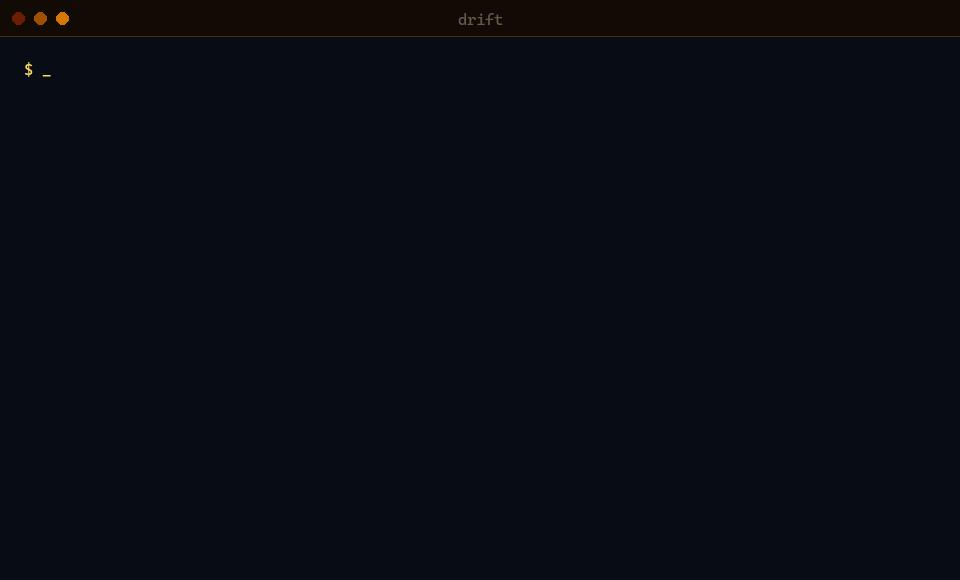

<div align="center">



# Drift

**Your architecture is drifting. Your linter won't tell you. Drift will.**

24 cross-file signals · 100 % ground-truth precision · deterministic, no LLM · ~30 s for a 2 900-file codebase

```bash
pip install drift-analyzer
drift setup          # 3-question wizard: picks the right profile for your project
drift status         # traffic-light health check — your daily entry point
```



[](https://github.com/mick-gsk/drift/actions/workflows/ci.yml)
[](benchmark_results/drift_self.json)
[](https://codecov.io/gh/mick-gsk/drift)
[](https://pypi.org/project/drift-analyzer/)
[](https://pypi.org/project/drift-analyzer/)
[](https://pypi.org/project/drift-analyzer/)
[](https://github.com/mick-gsk/drift/stargazers)
[](LICENSE)
[](https://github.com/mick-gsk/drift/discussions)

[Docs](https://mick-gsk.github.io/drift/) · [Quick Start](docs-site/getting-started/quickstart.md) · [Benchmarking](docs-site/benchmarking.md) · [Trust & Limitations](docs-site/trust-evidence.md)

</div>

---

## ⚡ Try it — zero install

```bash
uvx drift-analyzer analyze --repo .
```

> One command. No pre-install. Results in ~30 seconds.

🌐 **No install at all?** [Analyze any public repo in your browser →](https://mick-gsk.github.io/drift/prove-it/)

**Permanent install:** `pip install drift-analyzer` · Python 3.11+ · also via [pipx, Homebrew, Docker, GitHub Action, pre-commit →](docs-site/getting-started/installation.md)

| Metric | Value | Evidence |
|---|---|---|
| Ground-truth precision | **100 %** (47 TP, 0 FP) | [v2.7.0 baseline](benchmark_results/v2.7.0_precision_recall_baseline.json) |
| Ground-truth recall | **100 %** (0 FN, 114 fixtures) | [v2.7.0 baseline](benchmark_results/v2.7.0_precision_recall_baseline.json) |
| Mutation recall | **100 %** (25/25 injected) | [mutation benchmark](benchmark_results/mutation_benchmark.json) |
| Wild-repo precision | **77–95 %** (5 repos) | [study §5](docs/STUDY.md) |

> [!NOTE]
> **Drift eats its own dog food.** Every release runs `drift self` on its own source — same pipeline, same rules, no exceptions. Results: [drift_self.json](benchmark_results/drift_self.json)

---

## 🤔 Why drift?

Most linters catch single-file style issues. Drift catches what they miss:
cross-file structural drift that accumulates silently during AI-assisted development.

<table>
<tr><th>Without Drift</th><th>With Drift</th></tr>
<tr>
<td>

- Agent duplicates a helper in 3 modules — tests pass
- Layer boundary violated in a refactor — CI green
- Auth middleware reimplemented 4 ways — linter silent
- Score degrades over weeks — nobody notices

</td>
<td>

- `drift brief` injects structural guardrails *before* the agent writes code
- `drift nudge` flags new violations in real-time during the session
- `drift check` blocks the commit on high-severity findings
- `drift trend` tracks score evolution — regressions are visible

</td>
</tr>
</table>

> 🔍 **Before** — `drift brief` analyses your repo scope and generates structural constraints ready to paste into your agent prompt  
> 🚦 **After** — `drift check` runs 20+ cross-file signals and exits 1 on violations — CI, SARIF, and pre-commit ready  
> 🧠 **Over time** — Bayesian calibration reweights signals via feedback, git outcome correlation, and GitHub label correlation

---

## ⚙️ How it works

**Before a session — generate guardrails:**

```bash
drift brief --task "refactor the auth service" --format markdown
# → paste output into your agent prompt before delegation
```

**After a session — enforce structure:**

```bash
drift check --fail-on high         # local or CI gate
drift check --fail-on none         # pre-commit hook (advisory, report-only)
drift analyze --repo . --format json  # full report
```

📖 [Full workflow guide →](docs-site/getting-started/quickstart.md)

> [!TIP]
> **Best fit:** Python repos with 20+ files and active AI-assisted development.  
> Tiny repos produce noisy scores. Drift does not replace your linter, type checker, or security scanner — it covers the layer they cannot: cross-file structural coherence over time.

---

## 🔌 Works with

| AI Tools (MCP) | CI/CD | Git Hooks | Install |
|:---:|:---:|:---:|:---:|
| Cursor · Claude Code · Copilot | GitHub Actions · SARIF | pre-commit · pre-push | pip · pipx · uvx · Homebrew · Docker |

> **Bootstrap everything:** `drift init --mcp --ci --hooks` scaffolds config for all integrations in one command.

### GitHub Actions

[](https://github.com/marketplace/actions/drift-ai-code-coherence-monitor)

```yaml
# Try it — add this to .github/workflows/drift.yml
name: Drift
on: [push, pull_request]
jobs:
  drift:
    runs-on: ubuntu-latest
    permissions:
      security-events: write   # for SARIF upload
      pull-requests: write     # for PR comments
    steps:
      - uses: actions/checkout@v4
        with:
          fetch-depth: 0       # full history for temporal signals
      - uses: mick-gsk/drift@v1
        with:
          fail-on: none        # report-only — tighten once you trust the output
          upload-sarif: "true" # findings appear as PR annotations
          comment: "true"      # summary comment on each PR
```

**Outputs available** for downstream steps: `drift-score`, `grade`, `severity`, `finding-count`, `badge-svg`

### MCP / AI Tools

Cursor, Claude Code, and Copilot call drift directly via MCP server — the agent runs a full session loop:

| Phase | MCP Tool | What it does |
|---|---|---|
| **Plan** | `drift_brief` | Scope-aware guardrails injected into the agent prompt |
| **Code** | `drift_nudge` | Real-time `safe_to_commit` check after each edit |
| **Verify** | `drift_diff` | Full before/after comparison before push |
| **Learn** | `drift_feedback` | Mark findings as TP/FP — calibrates signal weights |

#### Copy-paste MCP config

**VS Code** — add to `.vscode/mcp.json`:

```json
{
  "servers": {
    "drift": {
      "type": "stdio",
      "command": "drift",
      "args": ["mcp", "--serve"]
    }
  }
}
```

**Claude Desktop** — add to `claude_desktop_config.json`:

```json
{
  "mcpServers": {
    "drift": {
      "command": "drift",
      "args": ["mcp", "--serve"]
    }
  }
}
```

**Cursor** — add to `.cursor/mcp.json`:

```json
{
  "mcpServers": {
    "drift": {
      "type": "stdio",
      "command": "drift",
      "args": ["mcp", "--serve"]
    }
  }
}
```

Or auto-generate: `pip install drift-analyzer[mcp] && drift init --mcp`

📖 [MCP setup guide →](docs-site/integrations.md)

**pre-commit:** Add `drift diff --staged-only` as a hook — findings block the commit before they reach CI.

📖 [Full integration guide →](docs-site/integrations.md)

---

## 🎛️ Configuration profiles

Pick a profile that matches your project — or start with `default` and calibrate later:

| Profile | Best for | Command |
|---|---|---|
| **default** | Most projects | `drift init` |
| **vibe-coding** | AI-heavy codebases (Copilot, Cursor, Claude) | `drift init -p vibe-coding` |
| **strict** | Mature projects, zero tolerance | `drift init -p strict` |
| **fastapi** | Web APIs with router/service/DB layers | `drift init -p fastapi` |
| **library** | Reusable PyPI packages | `drift init -p library` |
| **monorepo** | Multi-package repos | `drift init -p monorepo` |
| **quick** | First exploration, demos | `drift init -p quick` |

> **Team workflow:** Commit `drift.yaml` to your repo → CI enforces the same thresholds → team inherits calibrated weights.

📖 [Profile gallery with full details →](docs-site/guides/configuration-profiles.md) · [Configuration reference →](docs-site/getting-started/configuration.md)

---

<details>
<summary><b>Advanced: Adaptive learning, Negative context library, Guided mode</b></summary>

### Adaptive learning & calibration

Drift does not treat all signals equally forever. It maintains a per-repo profile:

- **Bayesian calibration engine** combines three evidence sources: explicit `drift feedback mark`, git outcome correlation, and GitHub issue/PR label correlation.
- **Feedback events** are stored as structured `FeedbackEvent` records and can be reloaded and replayed across versions (`record_feedback`, `load_feedback`).
- **Profile builder** (`build_profile`) produces a calibrated weight profile that `drift check` and `drift brief` use to focus on the most trusted signals in your codebase.

CLI surface: `drift feedback`, `drift calibrate`, `drift precision` (for your own ground-truth checks).

### Negative context library for agents

Drift can turn findings into a structured "what NOT to do" library for coding agents:

- **Per-signal generators** map each signal (PFS, MDS, AVS, BEM, TPD, …) to one or more `NegativeContext` items with category, scope, rationale, and confidence.
- **Anti-pattern IDs** like `neg-MDS-…` are deterministic and stable — ideal for referencing in policies and prompts.
- **Forbidden vs. canonical patterns**: each item includes a concrete anti-pattern code block and a canonical alternative, often tagged with CWE and FMEA RPN.
- **Security-aware**: mappings for `MISSING_AUTHORIZATION`, `HARDCODED_SECRET`, and `INSECURE_DEFAULT` generate explicit security guardrails for agents.

API: `findings_to_negative_context()` and `negative_context_to_dict()` deliver agent-consumable JSON for `drift_nudge`, `drift brief`, and other tools.

### Guided mode for vibe-coding teams

If your team ships most changes via AI coding tools (Copilot, Cursor, Claude), drift includes a guided mode:

- **CLI guide**: `drift start` prints the three-command journey for new users: `analyze → fix-plan → check` with safe defaults.
- **Vibe-coding playbook**: [examples/vibe-coding/README.md](examples/vibe-coding/README.md) documents a 30-day rollout plan (IDE → commit → PR → merge → trend) with concrete scripts and metrics.
- **Problem-to-signal map**: maps typical vibe-coding issues (duplicate helpers, boundary erosion, happy-path-only tests, type-ignore buildup) directly to signals like MDS, PFS, AVS, TPD, BAT, CIR, CCC.
- **Baseline + ratchet**: ready-made `drift.yaml`, CI gate, pre-push hook and weekly scripts implement a ratcheting quality gate over time.

📖 **Start here if you are a heavy AI-coding user:** [Vibe-coding technical debt solution →](examples/vibe-coding/README.md)

</details>

---

## 🔄 Coming from another tool?

**From Ruff / pylint:** Drift operates one layer above single-file style. It detects when AI generates the same error handler four different ways across modules — something no linter sees.

**From Semgrep / CodeQL:** Semgrep finds known vulnerability patterns in single files. Drift finds structural erosion across files — pattern fragmentation, layer violations, temporal volatility — that security scanners don't target.

**From SonarQube:** Drift runs locally with zero server setup and produces deterministic, reproducible findings per signal. Add it alongside SonarQube — not instead.

**From jscpd / CPD:** Drift's duplicate detection is AST-level, not text-level. It finds near-duplicates that text diff misses and places them in architectural context.

### Capability comparison

| Capability | drift | SonarQube | Ruff / pylint / mypy | Semgrep / CodeQL | jscpd / CPD |
|---|:---:|:---:|:---:|:---:|:---:|
| Pattern Fragmentation across modules | ✔ | — | — | — | — |
| Near-Duplicate Detection (AST-level) | ✔ | Partial (text) | — | — | ✔ (text) |
| Architecture Violation signals | ✔ | Partial | — | Partial (custom rules) | — |
| Temporal / change-history signals | ✔ | — | — | — | — |
| GitHub Code Scanning via SARIF | ✔ | ✔ | — | ✔ | — |
| Bayesian per-repo calibration | ✔ | — | — | — | — |
| MCP server for AI agents | ✔ | — | — | — | — |
| Zero server setup | ✔ | — | ✔ | ✔ | ✔ |
| TypeScript support | Partial ¹ | ✔ | — | ✔ | ✔ |

✔ = within primary design scope · — = not a primary design target · Partial = limited coverage

¹ Via `drift-analyzer[typescript]`. 17/24 signals supported via tree-sitter. Python is the primary analysis target.

Comparison reflects primary design scope per [STUDY.md §9](docs/STUDY.md).

---

## 🏷️ Add a drift badge to your README

Show your repo's drift score with a shields.io badge:

```bash
drift badge                    # prints URL + Markdown snippet
drift badge --format svg -o badge.svg  # self-contained SVG
```

Paste the Markdown output into your README:

```markdown
[](https://github.com/mick-gsk/drift)
```

**Automate in CI:** The [GitHub Action](https://github.com/marketplace/actions/drift-ai-code-coherence-monitor) exposes a `badge-svg` output — pipe it into your repo or a dashboard.

---

## 📚 Documentation

| Topic | Description |
|---|---|
| [Quick Start](docs-site/getting-started/quickstart.md) | Install → first findings in 2 minutes |
| [Brief & Guardrails](docs-site/integrations.md) | Pre-task agent workflow |
| [CI Integration](docs-site/getting-started/team-rollout.md) | GitHub Action, SARIF, pre-commit, progressive rollout |
| [Signal Reference](docs-site/algorithms/signals.md) | All 25 signals with detection logic |
| [Benchmarking & Trust](docs-site/benchmarking.md) | Precision/Recall, methodology, artifacts |
| [MCP & AI Tools](docs-site/integrations.md) | Cursor, Claude Code, Copilot, HTTP API |
| [Configuration](docs-site/getting-started/configuration.md) | drift.yaml, layer boundaries, signal weights |
| [Configuration Levels](docs-site/guides/configuration-levels.md) | Zero-Config → Preset → YAML → Calibration → MCP → CI |
| [Calibration & Feedback](docs-site/algorithms/scoring.md) | Bayesian signal reweighting, feedback workflow |
| [Vibe-coding Playbook](examples/vibe-coding/README.md) | 30-day rollout guide for AI-heavy teams |
| [Contributing](CONTRIBUTING.md) | Dev setup, FP/FN reporting, signal development |

---

## 🤝 Contributing

Drift's biggest blind spots are found by people running it on codebases the maintainers have never seen. A well-documented false positive can be more valuable than a new feature.

| I want to… | Go here |
|---|---|
| Ask a usage question | [Discussions](https://github.com/mick-gsk/drift/discussions) |
| Report a false positive / false negative | [FP/FN template](https://github.com/mick-gsk/drift/issues/new?template=false_positive.md) |
| Report a bug | [Bug report](https://github.com/mick-gsk/drift/issues/new?template=bug_report.md) |
| Suggest a feature | [Feature request](https://github.com/mick-gsk/drift/issues/new?template=feature_request.md) |
| Propose a contribution before coding | [Contribution proposal](https://github.com/mick-gsk/drift/issues/new?template=contribution_proposal.md) |
| Report a security vulnerability | [SECURITY.md](SECURITY.md) — not a public issue |

```bash
git clone https://github.com/mick-gsk/drift.git && cd drift && make install
make test-fast
```

<div align="center">
  <a href="https://github.com/mick-gsk/drift/graphs/contributors">
    
  </a>
</div>

See [CONTRIBUTING.md](CONTRIBUTING.md) · [ROADMAP.md](ROADMAP.md)

---

## 🔒 Trust and limitations

Drift's pipeline is deterministic and benchmark artifacts are published in the repository — claims can be inspected, not just trusted.

| Metric | Value | Artifact |
|---|---|---|
| Ground-truth precision | 100 % (47 TP, 0 FP) | [v2.7.0 baseline](benchmark_results/v2.7.0_precision_recall_baseline.json) |
| Ground-truth recall | 100 % (0 FN across 114 fixtures) | [v2.7.0 baseline](benchmark_results/v2.7.0_precision_recall_baseline.json) |
| Mutation recall | 100 % (25/25 injected patterns) | [mutation benchmark](benchmark_results/mutation_benchmark.json) |
| Wild-repo precision | 77 % strict / 95 % lenient (5 repos) | [study §5](docs/STUDY.md) |

- **No LLM in detection.** Same input, same output. Reproducible in CI and auditable.
- **Single-rater caveat:** ground-truth classification is not yet independently replicated.
- **Small-repo noise:** repositories with few files can produce noisy scores. Calibration mitigates but does not eliminate this.
- **Temporal signals** depend on clone depth and git history quality.
- **The composite score is orientation, not a verdict.** Interpret deltas via `drift trend`, not isolated snapshots.

Full methodology: [Benchmarking & Trust](docs-site/benchmarking.md) · [Full Study](docs/STUDY.md)

---

## ⭐ Star History

<div align="center">

[](https://www.star-history.com/#mick-gsk/drift&Date)

</div>

---

## 📄 License

MIT. See [LICENSE](LICENSE).
